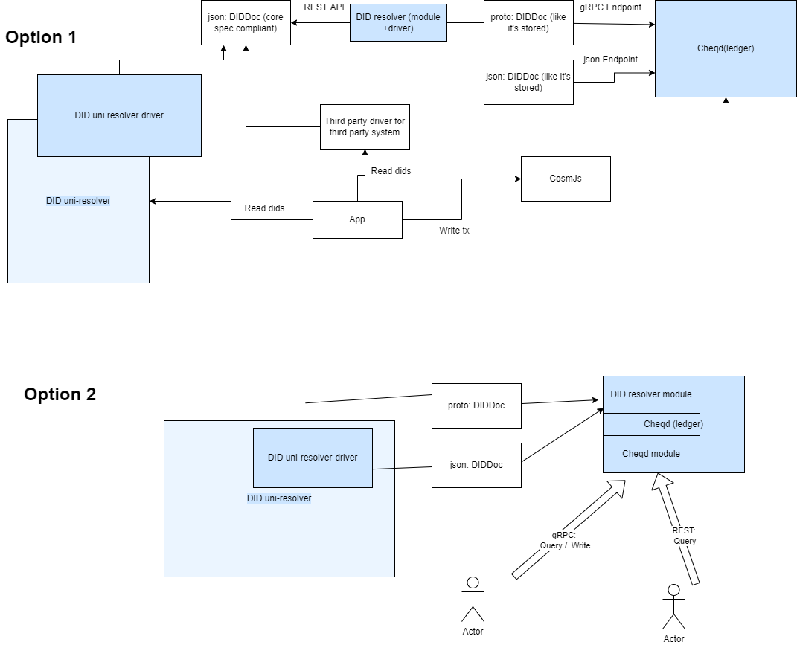

# ADR 009: DID-resolver

## Status

| Category | Status |
| :--- | :--- |
| **Authors** | Renata Toktar|
| **ADR Stage** | DRAFT |
| **Implementation Status** | Not Implemented |
| **Start Date** | 2022-02-22 |

## Summary

This document defines the architecture of two DID resolvers: Cheqd DID resolver and a universal DID resolver driver for integration with Universal resolver.

## Context
 
{}

## Decision

Add a new web application for did-resolver

First, let's look at the discrepancies between the DID Doc model stored in the ledger and the format from the specification. Data is written to the ledger based on protobuffs, which is due to the use of the Cosmos framework. However, according to the specification, DID Doc must be provided in JSON format, which provides more features that are not achievable in protobuffs.
Inconsistencies to be corrected:
* Rename "context" to "@context" - will be done on the ledger side
* Change snake_case to camelCase for field names - will be done on Cheqd resolver side using the marshaller setting
* Remove empty lists  - will be done on Cheqd resolver side using the marshaller setting
* DID URL Dereferencing: handle links to provide DID fragments and convert them to the desired format - Cheqd DID resolver functionality.

## Consequences

### Cheqd resolver
### Option 1 (chosen)
Host the resolver separately from the ledger as an additional web service. Interaction with other applications and resolvers will implement [the following schema] (https://drive.google.com/file/d/1pKL9I5fMhZ3TnAdkCiRTs53Y7zs9cGiv/view?usp=sharinghttps://drive.google.com/file/d/1pKL9I5fMhZ3TnAdkCiRTs53Y7zs9cGiv/view?usp=sharing):

#### Positive
* Updating the resolver software does not need updating the application on the node side
* Separation of the system into microservices, moving away from a monolithic structure

#### Negative
* Longer chain of trust. As a result, more resources required by the client to maintain the security of the system (`node + resolver` instead of `node`)

The web application at this stage will implement simple functionality that can be a lightweight architecture of threads without synchronization. Just several classes without the use of complex design patterns.

### Option 2
Put the resolver inside Cheqd-node as a new module or as a new handler (keeper) inside the node application.

#### Positive
The presentation of the data takes place next to the base where the data is stored. This
    * speeds up the process due to because of unnecessary data transferring between services
    * does not allow compromising the resolver, only the entire node, which is a more difficult task
* fault tolerance and availability of the blockchain network is higher than a single web server

#### Negative
* Unable to update resolver without updating node. However, expanding the functionality without breaking changes is also possible with minor releases, which allows update the node without upgrade transaction.

### Web service requirements
 helping to define its architecture in detail:
* Parallel executing of requests
* Synchronous execution of client requests
* Marshal/unmarshal JSON - object - protobuff
* Programming language: Go(?)

## References

- [W3C Decentralized Identifiers (DIDs)](https://www.w3.org/TR/did-core/) specification
    - [DID Core Specification Test Suite](https://w3c.github.io/did-test-suite/)

## Unresolved questions

Should the web service find another node for the request if it is not possible to connect to the node? So will the web service have a pool of trusted nodes for requesting?

